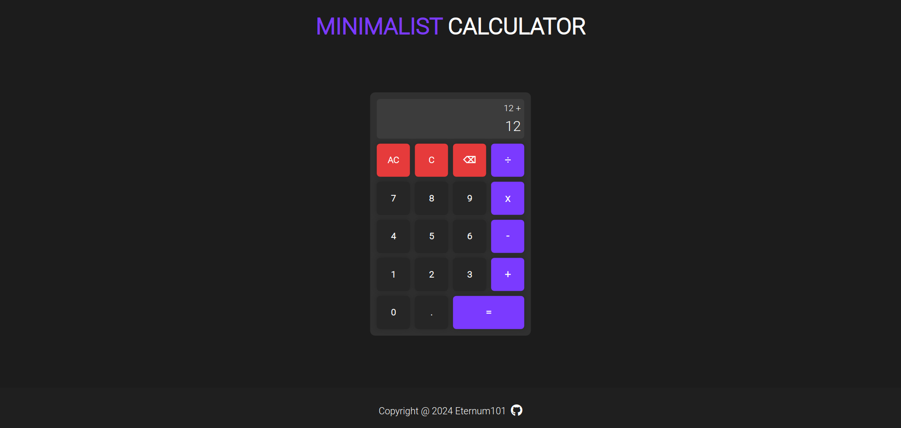

# Calculator

View Demo

## Table of Contents
- [About The Project](#about-the-project)
- [Built With](#built-with)
- [Screenshots](#screenshots)
- [Features](#features)

## About The Project
A on-screen calculator that performs arithmetic operations in a web-based application.

## Screenshots

### Initial Screen

### Operations

### Operations Output

### Floating Point Numbers

### Floating Point Numbers Output

[Back to Top](#calculator)

## Built With
- HTML
- CSS
- JavaScript

[Back to Top](#calculator)

## Features

- Basic Math Operators which includes Add, Subtract, Multiply, Divide
- Can Perform Multiple Operations in One Equation
- Supports Floating Point Numbers
- Implementation of All Clear, Clear & Backspace Button
- Keyboard Support

[Back to Top](#calculator)

